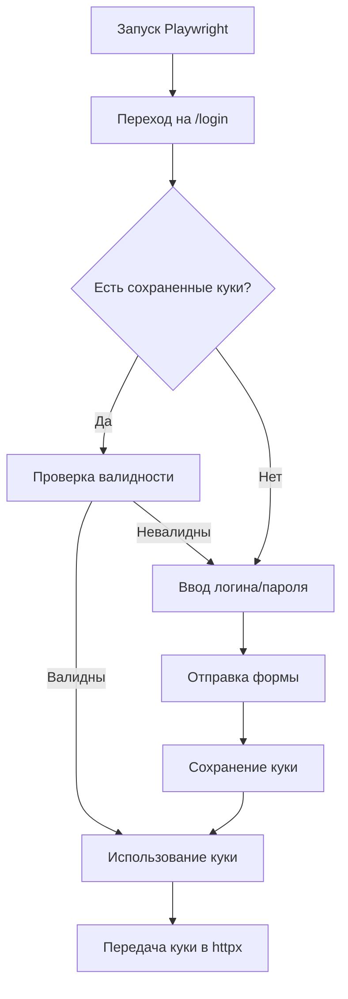

# 🚀 Руководство разработчика - Парсер Kwork

## 📖 Общий обзор

Этот проект представляет собой парсер для платформы Kwork.ru, построенный на FastAPI с интеграцией Playwright для аутентификации и HTTP-клиентом для парсинга данных.

## 🏗️ Архитектура проекта

```
app/
├── api/v1/              # API endpoints
│   ├── auth.py          # Аутентификация пользователей
│   ├── accounts.py      # Управление аккаунтами Kwork
│   ├── orders.py        # API для заказов
│   ├── chat.py          # API для чатов
│   ├── gigs.py          # API для кворков
│   ├── files.py         # Работа с файлами
│   └── quark.py         # API для Quark
├── core/                # Основные компоненты
│   ├── config.py        # Конфигурация приложения
│   ├── database.py      # Работа с SQLite
│   ├── security.py      # Шифрование и JWT
│   ├── rate_limiter.py  # Ограничение запросов
│   └── forbidden_routes.py # Заблокированные маршруты
├── services/            # Бизнес-логика
│   ├── kwork_client.py          # Основной клиент парсера
│   └── kwork_playwright_auth.py # Аутентификация через браузер
├── models/              # Модели данных
│   └── schemas.py       # Pydantic модели
└── utils/               # Утилиты
    └── file_handler.py  # Работа с файлами
```

## 🔧 Основные компоненты парсера

### 1. KworkClient (`app/services/kwork_client.py`)

**Основной класс для парсинга Kwork.ru**

#### Ключевые методы:

```python
# Аутентификация
await client.authenticate_with_playwright(show_browser=False, force_new_auth=False)

# Получение заказов
orders = await client.get_orders(page=1, limit=20, filters=None)

# Получение моих кворков
gigs = await client.get_my_gigs()

# Получение информации об аккаунте
account_info = await client.get_account_info()

# Получение списка чатов
chats = await client.get_chat_list()

# Получение сообщений чата
messages = await client.get_chat_messages(dialog_id="username")

# Отправка сообщения
await client.send_message(dialog_id="username", message="text")
```

#### Принципы работы:

- **HTTP-клиент**: Использует `httpx` для запросов
- **Rate Limiting**: Автоматическое ограничение частоты запросов
- **Парсинг HTML**: BeautifulSoup для извлечения данных
- **Сессии**: Сохранение куки между запросами

### 2. KworkPlaywrightAuth (`app/services/kwork_playwright_auth.py`)

**Аутентификация через браузер**

#### Основные возможности:

- **Автоматический режим**: Ввод логина/пароля программно
- **Ручной режим**: Открытие браузера для ручного ввода
- **Сохранение куки**: Автоматическое сохранение сессии
- **Валидация**: Проверка успешности входа

#### Использование:

```python
from app.services.kwork_playwright_auth import authenticate_kwork_account

# Автоматическая аутентификация
cookies = await authenticate_kwork_account(
    login="your_email@example.com",
    password="your_password",
    show_browser=False,
    force_new_auth=False
)

# Ручная аутентификация (откроется браузер)
cookies = await authenticate_kwork_account(
    login="your_email@example.com", 
    password="your_password",
    show_browser=True,
    force_new_auth=True
)
```

### 3. Rate Limiter (`app/core/rate_limiter.py`)

**Система ограничения запросов**

#### Лимиты по умолчанию:

- Аутентификация: 1 раз в 24 часа
- Общие запросы: 60 в минуту
- Отклики на заказы: 10 в час
- Сообщения: 30 в час

#### Конфигурация в `config.py`:

```python
MIN_DELAY = 1.0  # Минимальная задержка между запросами
MAX_DELAY = 3.0  # Максимальная задержка
MAX_REQUESTS_PER_MINUTE = 60
```

## 🎯 Как работает парсинг

### 1. Аутентификация



### 2. Парсинг заказов

**Endpoint**: `GET https://kwork.ru/` (главная страница с проектами)

**Парсинг происходит через**:
- HTML селекторы для карточек заказов
- Извлечение: ID, заголовок, описание, цена, категория
- Пагинация для получения дополнительных страниц

**Пример структуры данных**:
```json
{
  "success": true,
  "data": [
    {
      "id": "12345",
      "title": "Разработка сайта",
      "description": "Нужен современный сайт...",
      "price": 50000,
      "category": "Разработка и IT",
      "url": "https://kwork.ru/project/12345",
      "published_at": "1 час назад",
      "responses_count": 5
    }
  ],
  "page": 1,
  "total": 100,
  "has_next": true
}
```

### 3. Парсинг кворков

**Endpoint**: `GET https://kwork.ru/manage_kworks`

**Особенности**:
- Данные извлекаются из JavaScript переменной `stateData`
- Содержит полную информацию о кворках пользователя
- Статистика: просмотры, заказы, рейтинг

### 4. Парсинг чатов

**Endpoint**: `GET https://kwork.ru/inbox`

**Структура**:
- Список диалогов с клиентами
- Последние сообщения
- Количество непрочитанных

## 🔒 Безопасность

### Шифрование паролей

Пароли хранятся в зашифрованном виде с использованием Fernet:

```python
from app.core.security import encrypt_password, decrypt_password

# Шифрование при сохранении
encrypted = encrypt_password("user_password")

# Расшифровка при использовании  
password = decrypt_password(encrypted)
```

### Ключ шифрования

Генерируется автоматически и сохраняется в `encryption.key`:

```python
from cryptography.fernet import Fernet
key = Fernet.generate_key()
```

### JWT токены

Для API аутентификации используются JWT токены:

```python
from app.core.security import create_access_token, verify_token

# Создание токена
token = create_access_token(data={"sub": str(user_id)})

# Проверка токена
payload = verify_token(token)
```

## 🗄️ База данных

### Основные таблицы:

```sql
-- Пользователи системы
users (id, username, email, hashed_password, is_active, created_at)

-- Аккаунты Kwork
kwork_accounts (id, user_id, login, encrypted_password, account_name, 
                session_data, is_active, last_login, created_at)

-- Логи действий
action_logs (id, user_id, account_id, action_type, description, 
            ip_address, user_agent, timestamp)

-- Сессии
sessions (id, user_id, account_id, session_token, expires_at, 
          is_active, created_at)

-- Временные файлы
temp_files (id, user_id, filename, filepath, file_size, 
           content_type, created_at, expires_at)
```

## 🧪 Тестирование

### Настройка окружения:

1. Скопируйте `.env.example` в `.env`
2. Заполните учетные данные:
```bash
KWORK_TEST_USERNAME=your_email@example.com
KWORK_TEST_PASSWORD=your_password
```

### Запуск тестов:

```bash
# Основной тест парсера
python test_kwork_parser.py
```

### Структура тестов:

- **Аутентификация**: Проверка входа через Playwright
- **Парсинг заказов**: Получение и разбор списка проектов
- **Парсинг кворков**: Извлечение данных своих услуг
- **Информация об аккаунте**: Получение профиля пользователя

## 🚀 Запуск через Docker

### Сборка и запуск:

```bash
# Запуск всех сервисов
docker-compose up -d --build

# Только API и Redis
docker-compose up app redis -d --build
```

### Доступные сервисы:

- **API**: http://localhost:8000
- **Документация**: http://localhost:8000/docs
- **Redis**: localhost:6379
- **Nginx**: http://localhost (если включен)

## 📝 API Endpoints

### Аутентификация:
```
POST /api/v1/auth/register    # Регистрация
POST /api/v1/auth/login       # Вход
GET  /api/v1/auth/me          # Информация о пользователе
```

### Управление аккаунтами:
```
POST /api/v1/accounts/                    # Добавить аккаунт Kwork
GET  /api/v1/accounts/                    # Список аккаунтов
POST /api/v1/accounts/{id}/switch         # Переключить аккаунт
POST /api/v1/accounts/{id}/test-connection # Тест подключения
```

### Парсинг данных:
```
GET  /api/v1/orders/          # Получить заказы
GET  /api/v1/gigs/            # Получить кворки
GET  /api/v1/chat/            # Получить чаты
POST /api/v1/chat/{id}/send   # Отправить сообщение
```

## 🛠️ Доработка и расширение

### Добавление нового метода парсинга:

1. **Добавьте метод в KworkClient**:
```python
async def get_new_data(self) -> Dict[str, Any]:
    if not self.is_authenticated:
        return {"success": False, "error": "Not authenticated"}
    
    try:
        response = await self._make_request("GET", "/new-endpoint")
        # Логика парсинга
        return {"success": True, "data": parsed_data}
    except Exception as e:
        return {"success": False, "error": str(e)}
```

2. **Создайте API endpoint**:
```python
# В app/api/v1/new_endpoint.py
@router.get("/")
async def get_new_data(current_user = Depends(get_current_user)):
    client = await get_active_client()
    return await client.get_new_data()
```

3. **Добавьте тесты**:
```python
async def test_new_data_parsing():
    async with KworkClient("test", username, password) as client:
        await client.authenticate_with_playwright()
        result = await client.get_new_data()
        assert result["success"] == True
```

### Улучшение парсинга:

#### Обработка новых селекторов:
```python
# В методах парсинга добавляйте новые селекторы
selectors = [
    'div.new-selector',
    'article.updated-class',
    # Резервные селекторы
    'div[data-id]',
    'div:has(> h2)'
]
```

#### Обработка AJAX запросов:
```python
# Для динамического контента
async def get_dynamic_data(self, endpoint: str):
    response = await self._make_request(
        "GET", 
        endpoint,
        headers={"X-Requested-With": "XMLHttpRequest"}
    )
    return response.json()
```

### Добавление новых типов аутентификации:

```python
# В KworkClient
async def authenticate_with_api_key(self, api_key: str) -> bool:
    # Логика аутентификации через API ключ
    pass

async def authenticate_with_oauth(self, oauth_token: str) -> bool:
    # Логика OAuth аутентификации
    pass
```

## ⚠️ Важные замечания

### Rate Limiting:
- **Всегда соблюдайте ограничения** - превышение может привести к блокировке
- Используйте `await asyncio.sleep()` между запросами
- Мониторьте логи на предмет ошибок 429 (Too Many Requests)

### Обработка ошибок:
```python
try:
    result = await client.get_data()
except httpx.TimeoutException:
    # Таймаут запроса
    pass
except httpx.HTTPStatusError as e:
    # HTTP ошибка (4xx, 5xx)
    if e.response.status_code == 429:
        # Rate limit exceeded
        await asyncio.sleep(60)
except Exception as e:
    # Общая ошибка
    logger.error(f"Unexpected error: {e}")
```

### Изменения в структуре сайта:
- **Регулярно проверяйте селекторы** - сайт может обновляться
- Добавляйте несколько вариантов селекторов для надежности
- Используйте логирование для отслеживания изменений

### Куки и сессии:
- Куки сохраняются в `uploads/cookies/`
- Срок действия: 7 дней
- При истечении сессии выполняется повторная аутентификация

## 📊 Мониторинг и логирование

### Уровни логирования:
```python
import logging

# В коде используйте:
logger.info("Информационное сообщение")
logger.warning("Предупреждение") 
logger.error("Ошибка")
logger.debug("Отладочная информация")
```

### Мониторинг запросов:
- Все HTTP запросы логируются
- Отслеживается время выполнения
- Сохраняются ошибки аутентификации

### База данных логов:
```sql
-- Все действия сохраняются в action_logs
SELECT * FROM action_logs 
WHERE action_type = 'auth_failed' 
ORDER BY timestamp DESC;
```

## 🔄 Обновление и поддержка

### Обновление зависимостей:
```bash
pip install -r requirements.txt --upgrade
playwright install chromium
```

### Резервное копирование:
- База данных: `kwork_hub.db`
- Куки: `uploads/cookies/`
- Конфигурация: `.env`

### Версионирование:
- Используйте семантическое версионирование
- Ведите CHANGELOG.md
- Тегируйте релизы в Git

---

## 📞 Поддержка

При возникновении проблем:

1. Проверьте логи в консоли
2. Убедитесь в правильности учетных данных
3. Проверьте доступность kwork.ru
4. Убедитесь что аккаунт не заблокирован

**Удачной разработки! 🚀**